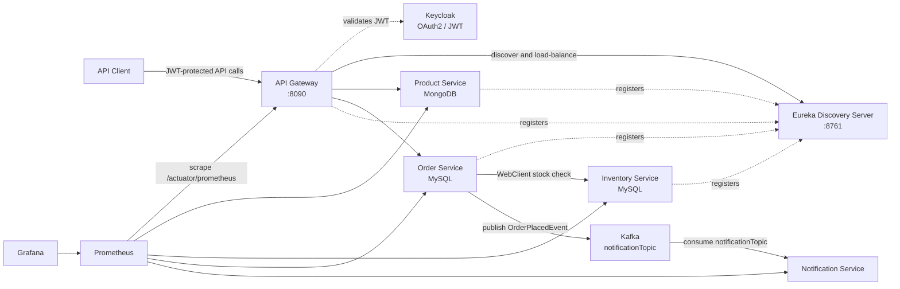

# Spring Boot Microservices Platform

A production-style e-commerce backend built as a Spring Boot microservices system. The project demonstrates service decomposition, service discovery, client-side load balancing, API gateway routing, synchronous service-to-service communication, resilience patterns, event-driven messaging, persistence across SQL and NoSQL databases, OAuth2/JWT security, observability, and containerized deployment.

The primary business flow is an order workflow: the Order Service validates stock through the Inventory Service, persists a successful order, and publishes an order event for the Notification Service. The services are independently deployable and discoverable through Eureka.

## Why This Project Matters

This project demonstrates the backend engineering skills expected in a Software Engineering role:

- Java 17 development with Spring Boot 3.5.4 and Spring Cloud 2025.0.0
- REST API design using controllers, DTOs, services, repositories, and domain models
- Microservice boundaries with independent data ownership
- Eureka-based service registration and discovery
- Spring Cloud Gateway as a single API entry point
- Client-side load balancing with `lb://` routes and multiple service instances
- Resilience4j circuit breaker, retry, and timeout handling with a fallback response
- Transactional order processing with Spring Data JPA and MySQL
- Product persistence with Spring Data MongoDB
- Kafka event publication and consumption for asynchronous notifications
- OAuth2 resource-server security with JWT validation and Keycloak realm/client roles
- Actuator and Prometheus metrics for operational visibility
- Docker Compose orchestration and Jib-built Docker images
- Maven multi-module project structure and Spring Boot testing support

## Architecture



## Services

| Module | Responsibility | Important implementation details | Default port |
| --- | --- | --- | --- |
| `discovery-server` | Service registry | Netflix Eureka Server; does not register itself or fetch a registry | `8761` |
| `api-gateway` | External API entry point | Spring Cloud Gateway, Eureka client, load-balanced routes, OAuth2 resource server | `8090` |
| `product-service` | Product catalog | Spring REST API and Spring Data MongoDB; configured with a random port for scaling | random locally, `8082` in Compose |
| `inventory-service` | Stock availability | Spring REST API, Spring Data JPA, MySQL; configured with a random port for scaling | random locally, `8083` in Compose |
| `order-service` | Order creation | Spring MVC, JPA/MySQL, WebClient inventory call, Resilience4j, Kafka producer | `8081` |
| `notification-service` | Order notification consumer | Kafka listener that consumes `OrderPlacedEvent` messages | `8084` in Compose |

## Core Flow: Placing an Order

1. A client sends `POST /api/order` through the API Gateway with order line items.
2. The gateway resolves the `order.service` instance through Eureka and forwards the request.
3. The Order Service creates an order number and maps the request DTO into persistent order entities.
4. The Order Service calls `GET /api/inventory?skuCode=...` with `WebClient`.
5. Eureka and the configured inventory URL allow the request to reach an Inventory Service instance.
6. The order is saved to MySQL only when every requested SKU is in stock.
7. The Order Service publishes an `OrderPlacedEvent` to Kafka topic `notificationTopic`.
8. The Notification Service consumes the event with `@KafkaListener` and logs the notification workflow.
9. If the inventory call fails, times out, or repeatedly fails, Resilience4j applies retry, timeout, and circuit breaker behavior before returning the fallback message.

## Service Discovery and Scaling

The Eureka server is the service registry. Each client service registers with the Eureka URL:

```text
http://localhost:8761/eureka
```

The Product and Inventory services use `server.port=0` for local runs. Spring assigns an available port, and Eureka records each instance. Starting the same service more than once creates multiple registered instances. The gateway and the Order Service can then resolve logical service names instead of hard-coded host ports.

The gateway uses load-balanced destinations:

```properties
spring.cloud.gateway.routes[0].uri=lb://product.service
spring.cloud.gateway.routes[1].uri=lb://order.service
```

This is the key difference between calling a fixed service port and calling a discoverable, scalable service.

## API Gateway Routes

| Public path | Destination | Purpose |
| --- | --- | --- |
| `/api/product` | `lb://product.service` | Create and list products |
| `/api/order` | `lb://order.service` | Place an order |
| `/eureka/web` | Eureka server | Proxy the Eureka web UI through the gateway |
| `/eureka/**` | Eureka server | Forward Eureka static resources and related paths |

The gateway listens on `http://localhost:8090`. Direct service ports are useful for development, but client traffic can use the gateway as the single entry point.

## Resilience4j

The order endpoint is protected with three Resilience4j patterns:

```java
@CircuitBreaker(name = "inventory", fallbackMethod = "fallbackMethod")
@TimeLimiter(name = "inventory", fallbackMethod = "fallbackMethod")
@Retry(name = "inventory")
```

- **Retry** gives a transient inventory failure another chance.
- **Time limiter** prevents an unresponsive inventory dependency from blocking indefinitely.
- **Circuit breaker** tracks failures and transitions between closed, open, and half-open states.
- **Fallback** returns `Oops! Something went wrong, please order after some time` when the protected call cannot complete successfully.

The Resilience4j configuration and runtime demonstrations belong in the screenshot section below. Keep the screenshot beside the corresponding explanation so the configured thresholds, retry events, timeout exception, and circuit state transitions are visible to reviewers.

## Event-Driven Notifications with Kafka

The Order Service publishes a JSON `OrderPlacedEvent` after a successful database save:

```text
Order Service -> Kafka notificationTopic -> Notification Service
```

The Notification Service listens to the same topic and consumes the event independently of the request thread. This keeps notification processing decoupled from order creation and gives the system a clear event-driven extension point for email, SMS, or other downstream actions.

## Data and Persistence

- **MySQL 8** stores orders and inventory data in separate databases: `order_db` and `inventory_db`.
- **MongoDB 6** stores product catalog documents in `product_db`.
- **Spring Data JPA** provides repositories and entity mapping for the SQL-backed services.
- **Spring Data MongoDB** provides the product repository for document persistence.
- Docker initialization scripts are mounted from `infrastructure/mysql-init` and `infrastructure/mongo-init`.

## Security with Keycloak

The API Gateway is configured as a reactive OAuth2 resource server. It validates JWTs issued by:

```text
http://localhost:8181/realms/spring-boot-microservices-realm
```

The security configuration permits Eureka paths and requires authentication for other gateway exchanges. It also maps roles from both `realm_access.roles` and `resource_access[*].roles` into Spring authorities such as `ROLE_user`.

Keycloak is an external prerequisite for the current Compose setup. Configure the matching realm, client, issuer URL, and user/client roles before testing authenticated gateway calls.

## Observability

The services expose Prometheus metrics through Spring Boot Actuator:

```text
http://localhost:<service-port>/actuator/prometheus
```

The repository includes Prometheus scrape configuration for Eureka, Product, Inventory, Order, Notification, and the API Gateway. Zipkin tracing is also configured with a local base URL of `http://localhost:9411`.

When the full Compose stack is running:

| Tool | URL |
| --- | --- |
| Eureka | `http://localhost:8761` |
| API Gateway | `http://localhost:8090` |
| Prometheus | `http://localhost:9090` |
| Grafana | `http://localhost:3000` |

## Running Locally

### Prerequisites

- JDK 17
- Maven 3.9 or newer
- Docker Desktop with Docker Compose
- Keycloak on port `8181` for authenticated gateway requests
- Optional: Zipkin on port `9411`

### 1. Start infrastructure

From the repository root:

```bash
docker compose up -d mysql mongodb zookeeper kafka
```

This starts MySQL, MongoDB, Zookeeper, and Kafka. The root Compose file also supports the complete containerized stack described below.

### 2. Build all modules

```bash
mvn clean verify
```

### 3. Start services in dependency order

Open a terminal for each process:

```bash
mvn -pl discovery-server spring-boot:run
mvn -pl product-service spring-boot:run
mvn -pl inventory-service spring-boot:run
mvn -pl order-service spring-boot:run
mvn -pl notification-service spring-boot:run
mvn -pl api-gateway spring-boot:run
```

Verify registration at `http://localhost:8761` and send API requests through `http://localhost:8090`.

### Example product requests

```bash
curl -X POST http://localhost:8090/api/product \
  -H "Content-Type: application/json" \
  -d '{"name":"Phone","description":"Demo phone","price":799.99}'

curl http://localhost:8090/api/product
```

### Example order request

```bash
curl -X POST http://localhost:8090/api/order \
  -H "Content-Type: application/json" \
  -d '{"orderLineItemsDtoList":[{"skuCode":"iphone_13","price":799.99,"quantity":1}]}'
```

## Running the Full Docker Compose Stack

Build and publish images with the Jib plugin configuration from the parent POM, or use already-published images:

```bash
mvn clean package jib:build
docker compose up -d
docker compose ps
```

The Compose stack runs the databases, Kafka and Zookeeper, Eureka, all application services, Prometheus, Grafana, and the gateway. Container environment variables replace local `localhost` defaults with Docker service names such as `mysql`, `mongodb`, `kafka`, and `discovery-server`.

Stop the stack with:

```bash
docker compose down
```

To remove persisted database and monitoring volumes as well:

```bash
docker compose down -v
```

## Repository Structure

```text
.
├── api-gateway/          # Gateway, routing, JWT resource-server security
├── discovery-server/     # Eureka registry
├── product-service/      # Product REST API backed by MongoDB
├── inventory-service/    # Inventory REST API backed by MySQL
├── order-service/        # Orders, inventory calls, resilience, Kafka producer
├── notification-service/ # Kafka consumer for order notifications
├── infrastructure/       # Database Compose file and initialization scripts
├── prometheus/           # Prometheus configuration
├── docker-compose.yml    # Full local platform
└── pom.xml               # Maven parent and module management
```

## Screenshot Portfolio

The following slots are intentionally kept for the project screenshots. Replace each blockquote with an image link, for example:

```markdown

```

### Eureka and Service Discovery

> **Screenshot 01 - Eureka discovery server:** Insert the Eureka dashboard showing the discovery server running.

> **Screenshot 02 - Inventory registered with Eureka:** Insert the inventory service mapped to the Eureka discovery server.

> **Screenshot 03 - Registered service instances:** Insert the Eureka dashboard showing running service instances.

> **Screenshot 04 - Multiple inventory instances:** Insert the extra Inventory Service instances running on randomly assigned ports.

> **Screenshot 05 - Multiple instances of a service:** Insert the Eureka view showing multiple instances of one service registered together.

### API Gateway

> **Screenshot 06 - Eureka and API Gateway:** Insert Eureka showing the API Gateway registered as a client.

> **Screenshot 07 - Gateway port access:** Insert a successful request made through port `8090` instead of the Product Service port.

> **Screenshot 08 - Product route mapping:** Insert the API Gateway route mapped to the Product Service.

> **Screenshot 09 - API Gateway running:** Insert the gateway application or gateway dashboard running.

> **Screenshot 10 - Eureka through the gateway:** Insert the Eureka server accessed through the API Gateway.

> **Screenshot 11 - Eureka static resources through gateway:** Insert the Eureka UI and static resources successfully served through the gateway.

### Resilience4j

> **Screenshot 12 - Resilience4j properties:** Insert the Order Service Resilience4j configuration properties.

> **Screenshot 13 - Fallback response:** Insert the fallback error message returned when the protected inventory call fails.

> **Screenshot 14 - Open circuit breaker:** Insert the circuit breaker status after failures open the circuit.

> **Screenshot 15 - Half-open circuit breaker:** Insert the half-open circuit breaker status during recovery testing.

> **Screenshot 16 - Timeout handling:** Insert the timeout exception and timeout event output from the retry/timeout test.

> **Screenshot 17 - Retry events:** Insert the retry events generated by Resilience4j.

### Containers and Event-Driven Architecture

> **Screenshot 18 - Docker Hub images:** Insert the service images uploaded to Docker Hub.

> **Screenshot 19 - Notification Service and Kafka:** Insert the Notification Service terminal showing the event-driven Kafka flow.

> **Screenshot 20 - Notification Service runtime:** Insert the second Notification Service terminal screenshot.

> **Screenshot 21 - Keycloak client:** Insert the Keycloak realm/client configuration used by the gateway.

> **Screenshot 22 - Docker Compose:** Insert the Docker Compose file or running Compose stack.

## Engineering Takeaways

This project is designed to show more than individual endpoints. It shows how to build and operate a distributed backend: isolate business capabilities, give services independent persistence, locate instances dynamically, route external traffic through a controlled boundary, protect dependency calls from cascading failures, communicate asynchronously where appropriate, secure the edge with standards-based JWT validation, expose metrics, and package the system for reproducible local deployment.

## License

This repository is a portfolio and learning project. Add a license here if the project is distributed publicly under specific terms.
